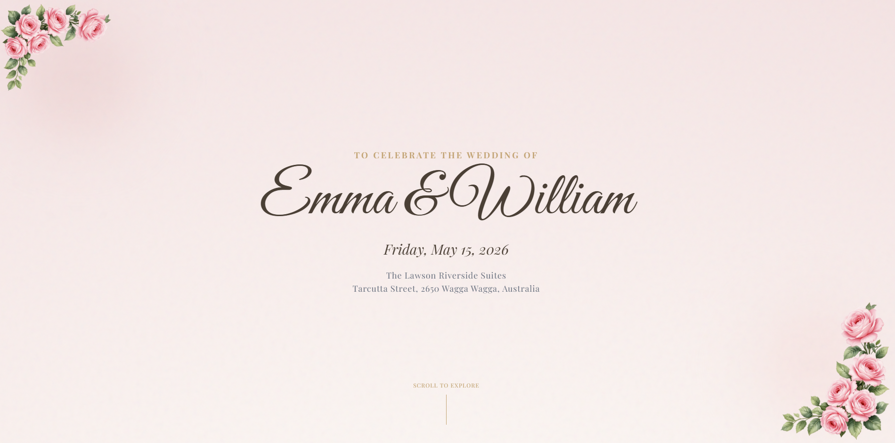
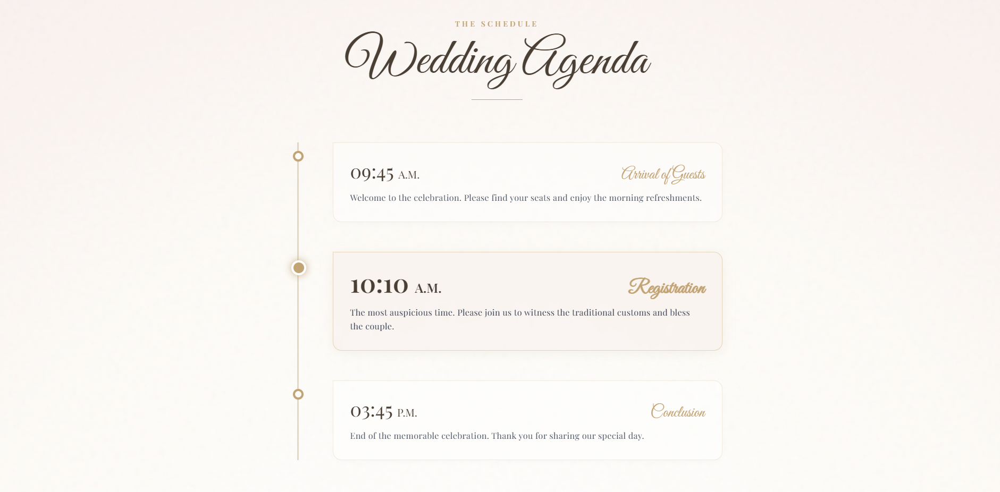
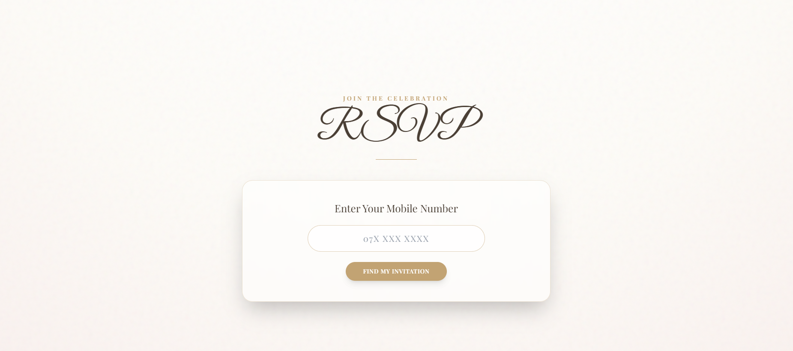
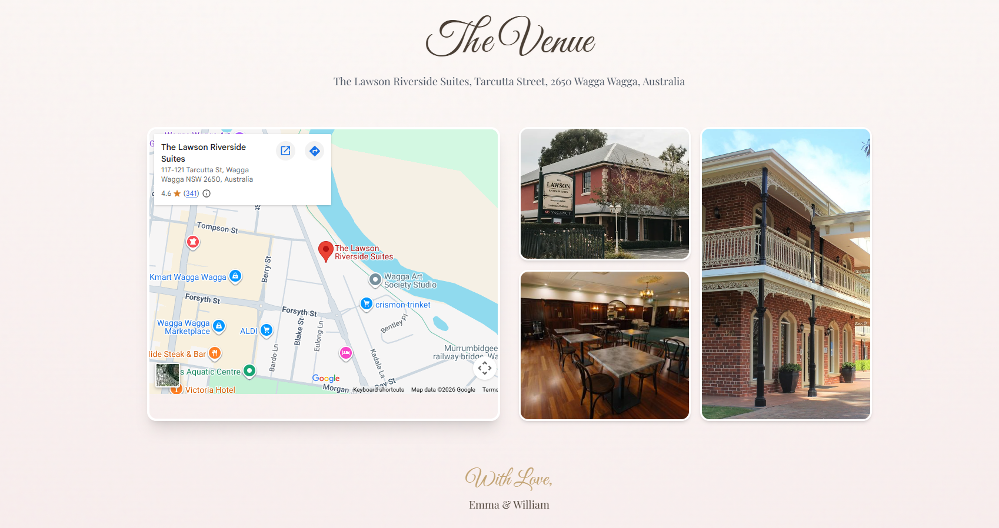

# Wedding Invitation Web App

A responsive wedding invitation web application designed to share event details, display couple information, and collect RSVP responses online.

## Features
- Responsive wedding invitation UI
- Bride and groom details section
- Event date, time, and location display
- RSVP form integration
- Dynamic content loading
- Gallery / photo section

## Technologies
- HTML
- CSS
- JavaScript
- Laravel
- MySQL

## Screenshots

### Home Page

### Agenda Section

### RSVP Form

### Gallery

### Venue

## Project Purpose
This project was developed as a full-stack web application to provide a modern digital wedding invitation experience.

## Author
Rasindu Thenuwara
